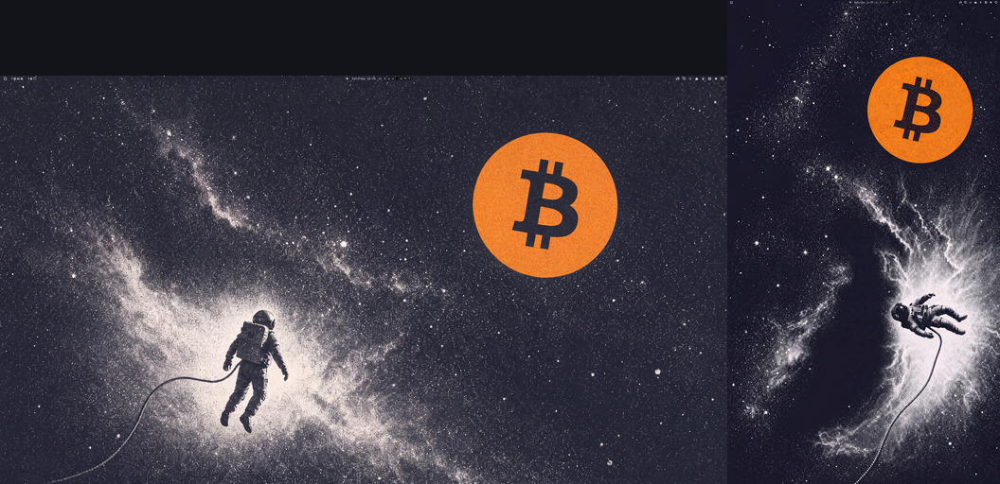
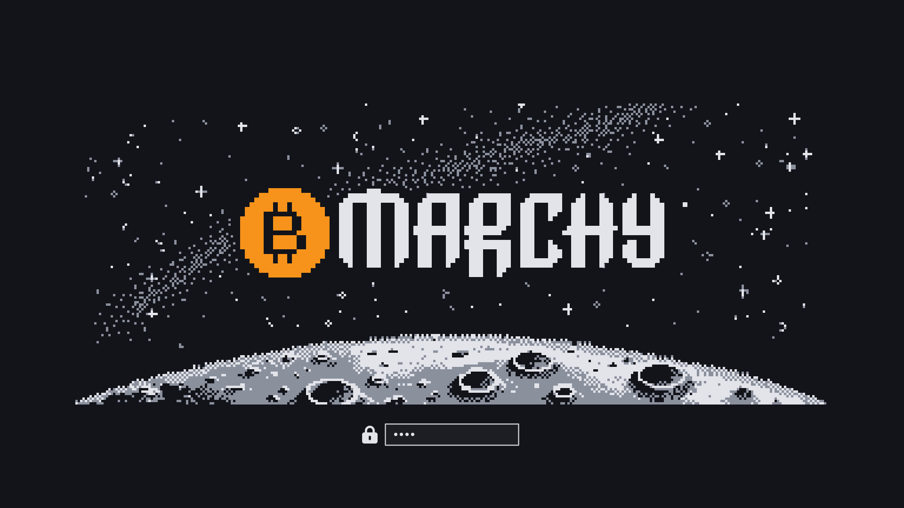

# Bitcoin Frontier — Omarchy theme

> Work in progress. Not yet submitted to the Omarchy theme gallery.

Charcoal-blue space, print-white nebulae, one flat bitcoin-orange coin.
Palette and print texture follow the *Navigating the Bitcoin Frontier*
risograph poster: stochastic spray-ink grain, no halftone dots.


## Install

```bash
omarchy theme install https://github.com/kravens/omarchy-bitcoin-frontier-theme
omarchy theme set bitcoin-frontier
```

## Contents

- `colors.toml` — palette (accent `#f7931a`, background `#12141a`)
- `backgrounds/` — three scenes at 3840x2160 (`1-moonrise` is the default and
  first in the cycle). `backgrounds/portrait/` holds 2160x3840 twins under the
  same file names; Omarchy's picker and cycle ignore the subfolder, and a
  background plugin that knows the convention (e.g. `kravens.background`, or
  Omarchy itself once omacom/omarchy#11534 lands) shows the twin on portrait
  screens:

  
- `icons.theme` — Yaru-red-dark
- `hyprland.lua` — orange borders, fully opaque focused window. Only applies
  when the theme lives in `~/.config/omarchy/themes` by hand; Omarchy drops
  `*.lua` from themes installed with `omarchy theme install` and regenerates
  them from `colors.toml`.
- `refine-4k.sh` — how the wallpapers were made (ppq.ai image models, then
  ImageMagick). Needs a ppq.ai key in the keyring; not needed to use the theme.

## Companion bar widget

[BTClock](https://github.com/kravens/omarchy-btclock) (`kravens.btclock`, listed in the
[Omarchy plugin marketplace](https://plugins.omarchy.org/plugin.html?id=kravens.btclock))
shows block height, fiat price, Moscow time and mempool fee rates on
e-paper-style panels in the bar, in this theme's palette. Optional:

```bash
omarchy plugin add https://github.com/kravens/omarchy-btclock --enable
```

## Wallpapers

Generated with `openai/gpt-5.4-image-2` (look) and
`google/gemini-3.1-flash-image-preview` (native 4K pass) via ppq.ai, from the
theme's earlier drafts and the poster as style reference. Grain on the coin is
added in ImageMagick. Bitcoin logo: public domain.

## Boot / login splash



`unlock.png` is the Plymouth boot and SDDM login logo: the stock pixel-art
OMARCHY wordmark in print white, its O replaced by a pixel bitcoin coin, over
a dithered star field, a faint Milky Way band and a cratered moon limb along
the bottom edge -- the password field sits right under that horizon. The
backdrop was drawn by `openai/gpt-5.4-image-2` (via ppq.ai), then snapped to a
5 px pixel grid and the theme's five colours (`splash-cells.png`);
`make-splash.py` assembles it with the untouched stock wordmark.
Apply with:

```bash
omarchy plymouth set-by-theme bitcoin-frontier
```
